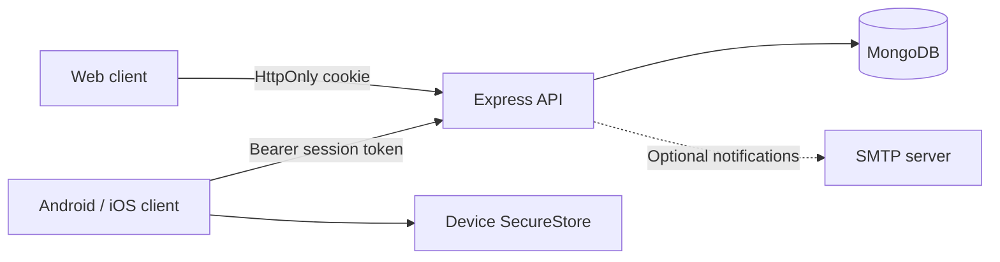

# Architecture

## Overview

The client is one Expo application with React Native components. React Native Web renders the same screens in a browser. Platform-specific PDF modules provide browser downloads and native print/share support without maintaining separate applications.

The client sends all API requests through `frontend/src/api.js`, which manages the API base address, request protection header, timeout and unauthorized-session handling. Browser credentials are sent as cookies; native credentials are loaded from SecureStore. Native release builds require an HTTPS API URL.

## Authentication and authorization

Successful login creates an eight-hour opaque session. The browser receives an HttpOnly cookie; native clients receive a token for SecureStore. MongoDB stores only the token's SHA-256 hash. Every protected request loads both the session and its current account, checking expiry, account status and session version.

Roles are `security`, `admin` and `superadmin`. Faculty administrators receive faculty-scoped data and can review only their faculty's equipment requests. Campus administrators can provision accounts and review all faculties. Gate officers record movements, but cannot approve equipment requests or create staff registrations.

Password changes invalidate all sessions. Account disabling revokes access immediately. Profile updates allow only name, phone and biography. Gate/faculty assignments are managed through privileged account routes.

## Vehicle lifecycle

1. A gate officer records an arrival. The server creates the pass ID, timestamp and gate from the authenticated account.
2. A visit without equipment is approved automatically. A visit with equipment is marked `Pending Approval` while the vehicle is inside.
3. The permitted administrator approves or rejects the equipment request. The server records the approving identity and generates the equipment gate-pass number.
4. Rejected requests can be resubmitted with revised notes for a new review.
5. The officer confirms departure after approval. Equipment-bearing visits require an exit-verification note. The exit gate can differ from the entry gate.

A partial unique index permits only one active visit per normalized vehicle number. Approval and departure updates use conditional database operations so simultaneous requests cannot successfully transition the same visit twice.

## Data models

| Model | Purpose |
|---|---|
| User | Identity, password hash, role, assignment, profile and account lockout |
| Session | Hashed token, account/version, device description and expiry |
| VehicleRecord | Arrival, equipment decision, departure and responsible identities |
| FrequentTraveler | Registered staff details and persistent lookup pass ID |
| Audit | Successful operational/account action, actor, target and timestamp |

Staff QR codes contain only the registration pass ID. They support lookup; they do not prove identity or grant permission to remove equipment.

## Boundaries and tradeoffs

- Vehicle history is paginated in groups of 30; PDF reports fetch matching pages with a 3,000-record export ceiling.
- The dashboard refreshes every 30 seconds. It does not provide a real-time push channel or gate staffing status.
- SMTP notifications are optional and are not a durable queue. The in-app record remains authoritative when email delivery fails.
- Audit inserts and operational writes are separate database operations. Transactional audit guarantees and external immutable storage are future deployment work.
- Account lockout is persisted in MongoDB, but request rate limiting uses process-local storage. Multi-instance deployments need shared rate-limit storage.
- Offline movement writes are deliberately unsupported because they could conflict with approval state and duplicate active visits.
- Exported reports are not database snapshots; concurrent activity can change results between pages.

See [security guidance](../SECURITY.md), [setup instructions](../README.md) and [verification limits](../VERIFICATION.md) before deployment.
